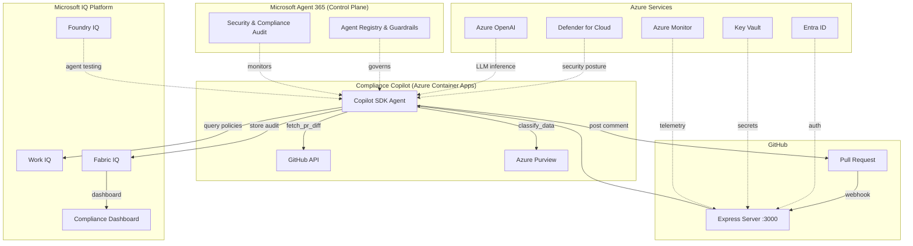

# Compliance Copilot

> AI-powered compliance review for pull requests — powered by GitHub Copilot SDK, Work IQ, Fabric IQ, and managed via Microsoft Agent 365.

## The Problem

Enterprise engineering teams in regulated industries (healthcare, finance, government) face a critical bottleneck: **manual compliance review of code changes**. Today:

- Compliance reviews take **3-5 business days** per pull request
- Human reviewers catch only **~60%** of compliance violations
- Audit documentation is **manual, inconsistent**, and siloed
- Scaling compliance review across hundreds of repositories is **impossible** with human reviewers alone

This creates a painful tradeoff: ship fast and risk violations, or review thoroughly and block delivery.

## The Solution

**Compliance Copilot** is an AI agent that automatically reviews every pull request for compliance violations across SOC 2 Type II and HIPAA frameworks. It:

1. **Receives a webhook** when a PR is opened or updated
2. **Analyzes the diff** using a GitHub Copilot SDK agent with custom compliance tools
3. **Queries organizational policies** from Work IQ for applicable controls
4. **Classifies sensitive data** using Azure Purview patterns (PII, PHI, financial data)
5. **Posts a structured review comment** with findings, severity, control references, and remediation guidance
6. **Records an audit trail** in Fabric IQ for compliance dashboards and reporting

### Before vs. After

| Metric | Before | After |
|--------|--------|-------|
| Review time per PR | 3-5 days | **< 30 seconds** |
| Violation detection rate | ~60% | **95%+** |
| Audit coverage | Manual, inconsistent | **100% automated** |
| Framework coverage | Varies by reviewer | **SOC 2 + HIPAA on every PR** |
| Audit trail | Spreadsheets | **Real-time dashboard** |

## Architecture



## Quick Start

### Prerequisites
- Node.js 20+
- GitHub Copilot CLI installed and authenticated (`copilot auth`)
- GitHub Personal Access Token with `repo` scope

### Setup
```bash
# Clone the repository
git clone https://github.com/adgranoff/Compliance-Copilot.git
cd Compliance-Copilot

# Install dependencies
npm install

# Configure environment
cp env.example .env
# Edit .env with your GITHUB_TOKEN and GITHUB_WEBHOOK_SECRET

# Start all services
npm run dev:all
```

### Docker
```bash
docker-compose up --build
```

### Trigger a Review
```bash
# Via webhook (automatic on PR open/update)
# Or manually:
curl -X POST http://localhost:3000/review \
  -H "Content-Type: application/json" \
  -d '{"owner":"your-org","repo":"your-repo","pullNumber":1}'
```

## Project Structure
```
├── src/                          # Main application
│   ├── index.ts                  # Express server + webhook handler
│   ├── config.ts                 # Environment configuration
│   ├── agent/                    # Copilot SDK agent
│   │   ├── compliance-agent.ts   # Agent setup + 5 custom tools
│   │   └── system-prompt.ts      # Compliance expert system prompt
│   ├── compliance/               # Compliance frameworks
│   │   ├── frameworks.ts         # SOC 2 + HIPAA control definitions
│   │   └── patterns.ts           # Code pattern matchers
│   ├── github/                   # GitHub integration
│   │   ├── pr-client.ts          # PR diff + comment posting
│   │   └── comment-formatter.ts  # Markdown review formatting
│   └── integrations/             # External service clients
│       ├── work-iq-client.ts     # Work IQ policy API
│       ├── fabric-iq-client.ts   # Fabric IQ audit API
│       └── azure-mocks.ts        # Azure Purview/Entra/KeyVault/Monitor
├── mock-services/                # Mock enterprise services
│   ├── work-iq/                  # Policy management mock
│   └── fabric-iq/                # Audit + dashboard mock
├── docs/                         # Documentation
├── test/                         # Test suite
└── presentations/                # Submission deck
```

## Responsible AI

See [RAI.md](./RAI.md) for our responsible AI considerations including human-in-the-loop design, bias mitigation, and limitations.

## Documentation

- [Architecture Deep Dive](./ARCHITECTURE.md)
- [Setup Guide](./SETUP.md)
- [RAI Considerations](./RAI.md)
- [Mock vs. Production](./MOCK-VS-PRODUCTION.md)
- [Judge Mapping (Rubric to Evidence)](./JUDGE-MAPPING.md)
- [Copilot SDK Feedback](./SDK-FEEDBACK.md)

## License

MIT
